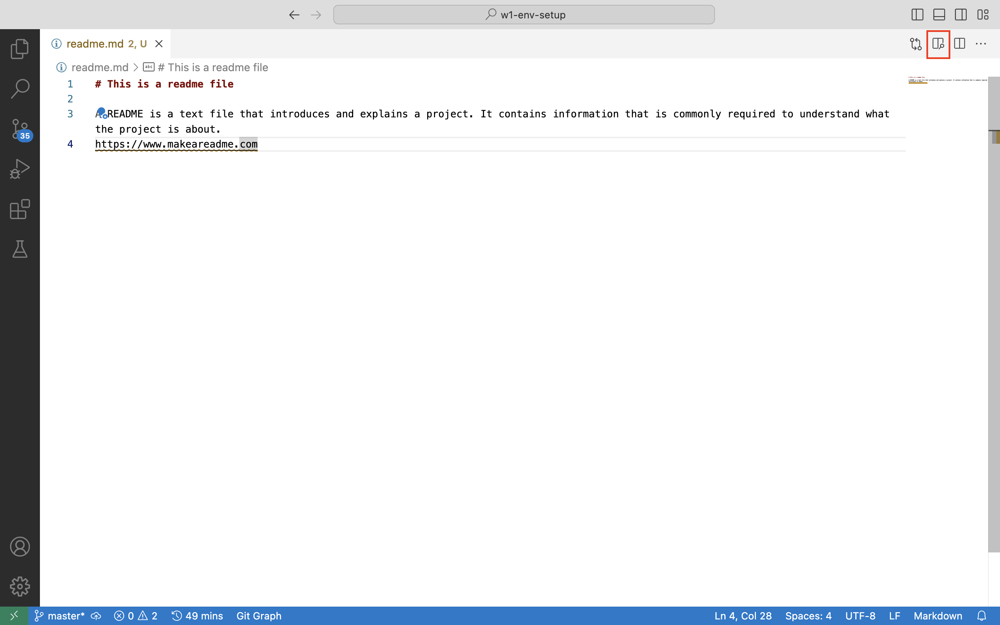

# This is a readme file

A README is a text file that introduces and explains a project. It contains information that is commonly required to understand what the project is about.
<https://www.makeareadme.com>

All of the contents of readme file can be written using a Markdown format

References:

- <https://www.makeareadme.com/#template-1>
- <https://commonmark.org/help/>
- <https://commonmark.org/help/tutorial/>

To preview the rendered version of this file you can click this icon in your VS Code.

